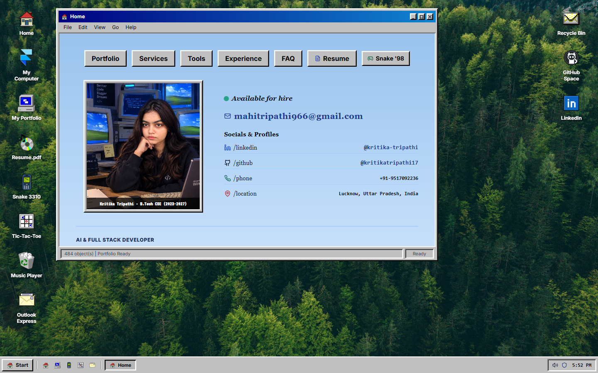
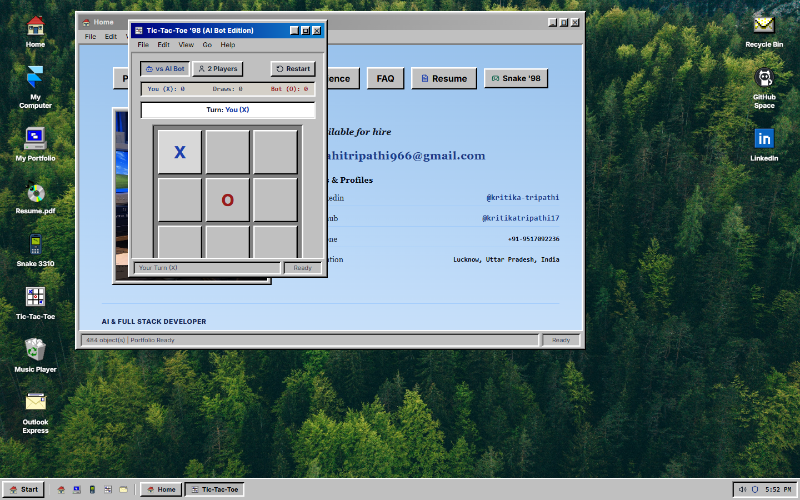
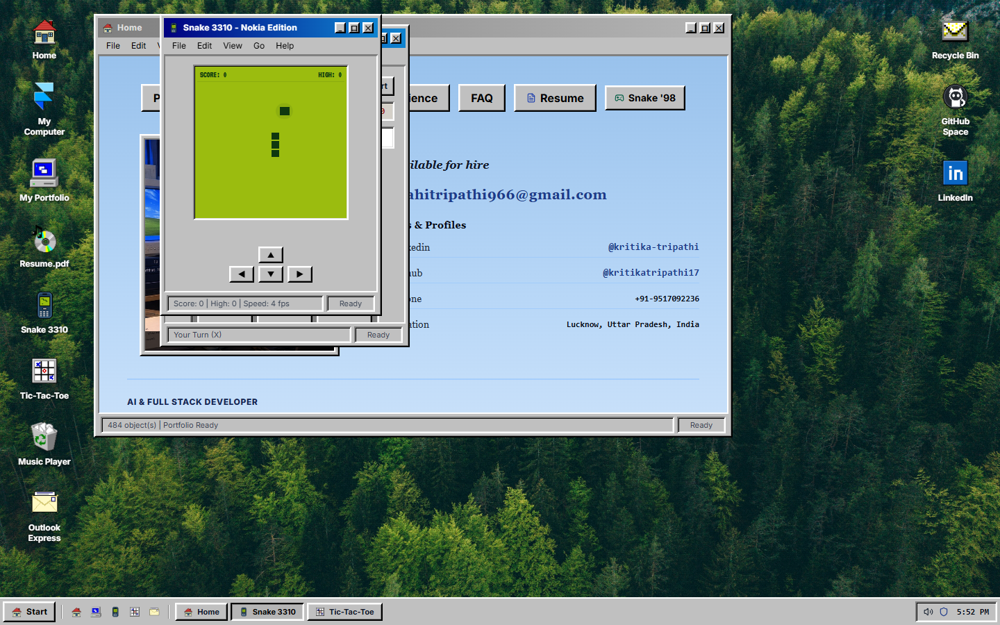
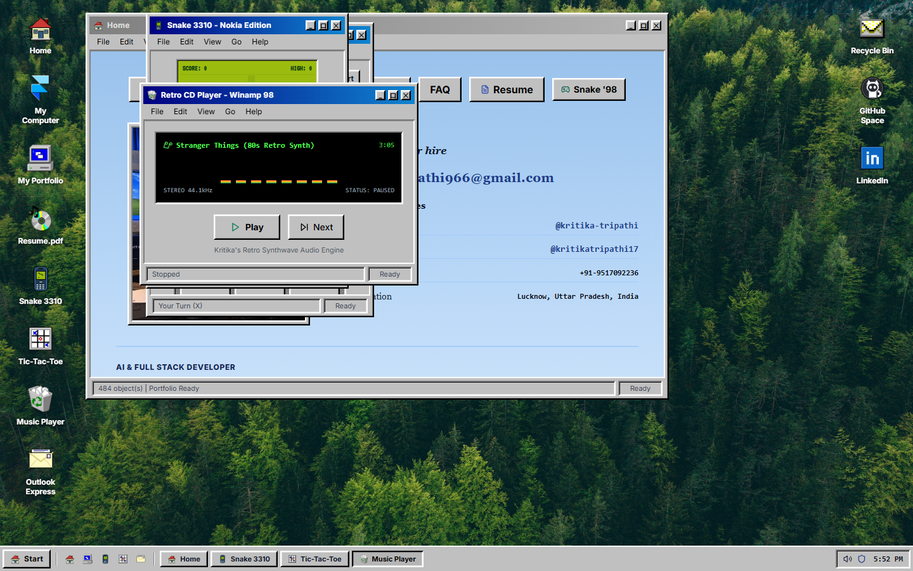

  

  # 🪟 Kritika OS '98
  ### Interactive Retro Windows 95/98 Operating System & Developer Portfolio

  **A nostalgia-infused, fully functional Web OS celebrating the golden age of personal computing.**  
  *Engineered for Kritika Tripathi · AI & Full Stack Developer*

   

  
  
  
  
  
  

   
   

  

---

## 🧭 Navigation

- [✨ Overview](#-overview)
- [📸 Feature Showcase](#-feature-showcase)
- [🕹️ Interactive Applications](#️-interactive-applications)
- [🛠️ Tech Stack & Architecture](#️-tech-stack--architecture)
- [🚀 Local Development](#-local-development)
- [☁️ Deploy to Vercel](#️-deploy-to-vercel)
- [📬 Connect with Kritika](#-connect-with-kritika)

---

## ✨ Overview

**Kritika OS '98** is a production-ready, interactive personal portfolio disguised as an authentic late-90s Windows desktop operating system. Built from scratch with modern web standards, it delivers a deeply nostalgic, tactile pair-programming experience with retro 3D beveled windows, realistic mechanical sound effects, retro arcade games, and Web Audio synthesizers—while showcasing production AI/ML engineering, full-stack web applications, and five completed internships.

### Highlights
- ⚡ **Zero-Latency Interactions**: Draggable, resizable, stackable windows with custom retro scrollbars.
- 🎛️ **Hardware Sound Synthesis**: Built-in synthesizer for keyboard clicks, startup chimes, error buzzers, and retro synth music via native Web Audio API (zero audio file bloat).
- 📱 **Adaptive Retro Viewport**: Responsive window positioning that gracefully handles both wide desktop monitors and mobile devices.
- 📄 **ATS-Optimized Resume Viewer**: Integrated Adobe Acrobat Reader '98 rendering an industry-standard 1-page resume with one-click download.

---

## 📸 Feature Showcase

| 🤖 AI Bot Tic-Tac-Toe '98 | 🐍 Nokia 3310 Snake Arcade |
|:---:|:---:|
|  |  |
| *Smart strategic bot with thinking delays, win-block moves & scoreboard* | *Authentic dot-matrix green LCD, dynamic speed curve & D-pad* |

| 🎵 Winamp 98 (Stranger Things Synth) | 🪟 Full Desktop Environment |
|:---:|:---:|
|  |  |
| *80s arpeggio synthesizer with resonant filter sweep & live equalizer* | *Workable desktop icons, active taskbar tabs & retro Start menu* |

---

## 🕹️ Interactive Applications

`
┌───────────────────────────┬──────────────────────────────────────────────────────────────┐
│ Application               │ Description                                                  │
├───────────────────────────┼──────────────────────────────────────────────────────────────┤
│ 🏠 Home Window            │ Developer profile, 5 internships timeline, technical         │
│                           │ services, tools grid, and FAQ accordion.                     │
│                           │                                                              │
│ 📁 My Portfolio           │ 2x2 production projects showcase with dark CRT previews,     │
│                           │ live Vercel demos, GitHub links, and architectural modal.    │
│                           │                                                              │
│ 🤖 Tic-Tac-Toe '98        │ Play against 'Kritika-Bot' (smart AI with winning-move       │
│                           │ calculation & block detection) or 2-player mode + confetti.  │
│                           │                                                              │
│ 🐍 Snake 3310 (Nokia)     │ Classic Nokia arcade game with green LCD display, keyboard   │
│                           │ controls (Arrows/WASD) + on-screen D-pad.                    │
│                           │                                                              │
│ 📻 Winamp 98 Media Player │ 4-track retro audio engine featuring the 80s Stranger Things │
│                           │ analog synth arpeggio and real-time stereo equalizer.        │
│                           │                                                              │
│ 📄 Resume.pdf (Acrobat)   │ Single-page ATS resume viewer styled after Acrobat '98 with  │
│                           │ instant PDF download and print capabilities.                 │
│                           │                                                              │
│ 💻 My Computer            │ Windows 98 System Properties dialog detailing CPU, RAM,      │
│                           │ verified technologies, and credentials.                      │
│                           │                                                              │
│ ✉️ Outlook Express        │ Retro email composer pre-configured to send direct messages  │
│                           │ to mahitripathi966@gmail.com.                                │
└───────────────────────────┴──────────────────────────────────────────────────────────────┘
`

---

## 🛠️ Tech Stack & Architecture

### Core Technologies
- **Frontend Framework**: [React 18.3](https://react.dev/)
- **Build Tool**: [Vite 6.0](https://vitejs.dev/)
- **Styling**: [Tailwind CSS 3.4](https://tailwindcss.com/) + Custom Win98 3D Bevel Engine (win-box-out, win-box-in, win-btn, win-titlebar)
- **Sound & Music Synthesis**: [Web Audio API](https://developer.mozilla.org/en-US/docs/Web/API/Web_Audio_API) (dual sawtooth/sine oscillators, biquad lowpass resonant filters, gain envelopes)
- **Visuals & Effects**: Canvas Confetti, CRT Scanlines, Pixel Art Sprites, [Lucide React](https://lucide.dev/)

### Directory Structure
`	ext
portfolio/
├── public/
│   ├── assets/
│   │   ├── icons/            # Pixel-art sprites (home, snake, tictactoe, mail, etc.)
│   │   ├── screenshots/      # High-res README previews
│   │   ├── wallpaper.jpg     # Nostalgic Win98 pine forest wallpaper
│   │   └── portrait.jpg      # Developer workstation photo
│   ├── resume.pdf            # 1-page ATS formatted resume
│   └── favicon.ico           # Retro Windows icon
├── src/
│   ├── components/
│   │   ├── BiosScreen.jsx    # Energy Star parody POST boot screen
│   │   ├── LockScreen.jsx    # CRT auto-login sequence with typing animation
│   │   ├── Desktop.jsx       # Desktop icon matrix & window coordinator
│   │   ├── Window.jsx        # Draggable, stackable Windows 98 window frame
│   │   ├── HomeWindow.jsx    # Bio, experience timeline, services, FAQ
│   │   ├── PortfolioWindow.jsx # Production projects showcase
│   │   ├── ProjectModal.jsx  # Deep-dive architecture modal
│   │   ├── NokiaSnake.jsx    # Nokia 3310 Snake game
│   │   ├── TicTacToe.jsx     # AI Bot Tic-Tac-Toe game
│   │   ├── MusicPlayer.jsx   # Winamp 98 (Stranger Things synthesizer)
│   │   ├── ResumeModal.jsx   # Adobe Acrobat '98 PDF viewer
│   │   ├── SystemInfoModal.jsx # My Computer System Properties
│   │   ├── ContactModal.jsx  # Outlook Express email client
│   │   └── Taskbar.jsx       # Start menu, quick launch & system tray
│   ├── data/
│   │   └── resumeData.js     # Single source of truth for resume & skills
│   ├── utils/
│   │   └── audio.js          # Web Audio sound FX synthesizer
│   ├── App.jsx               # Boot & desktop state machine
│   └── index.css             # Windows 98 CSS theme & CRT scanlines
├── vercel.json               # Pre-configured Vercel routing
├── package.json
└── vite.config.js
`

---

## 🚀 Local Development

### Prerequisites
- [Node.js](https://nodejs.org/) (version 18 or higher recommended)
- 
pm (bundled with Node.js)

### 1. Clone the repository
`ash
git clone https://github.com/krtx17/Portfolio.git
cd Portfolio
`

### 2. Install dependencies
`ash
npm install
`

### 3. Start development server
`ash
npm run dev
`
Open [http://localhost:3000](http://localhost:3000) in your browser.

### 4. Build for production
`ash
npm run build
`

---

## ☁️ Deploy to Vercel

This repository includes a production-ready ercel.json for one-click deployment:

1. Go to **[vercel.com/new](https://vercel.com/new)**.
2. Sign in with GitHub and select **Portfolio** from your repository list.
3. Keep default settings:
   - **Framework Preset**: Vite
   - **Build Command**: 
pm run build
   - **Output Directory**: dist
4. Click **Deploy**!

---

## 📬 Connect with Kritika

- **Developer**: **Kritika Tripathi**
- **Education**: B.Tech in Computer Science & Engineering (2023 – 2027)
- **Email**: [mahitripathi966@gmail.com](mailto:mahitripathi966@gmail.com)
- **LinkedIn**: [linkedin.com/in/kritika-tripathi](https://www.linkedin.com/in/kritika-tripathi-837441246)
- **GitHub**: [@krtx17](https://github.com/krtx17)

 

  Crafted with nostalgic ❤️ and modern web precision.

